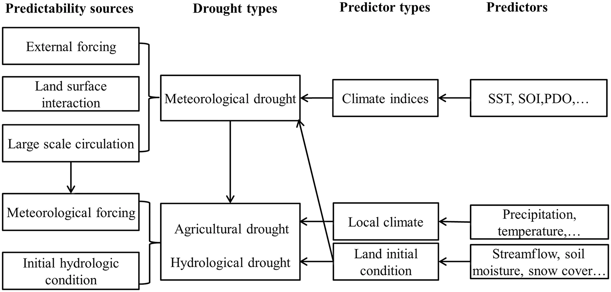
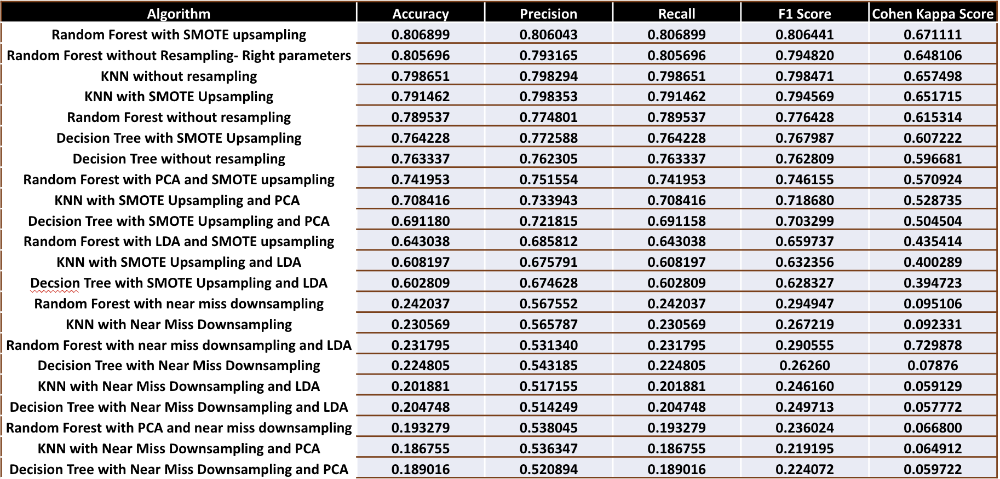

# Abstract
*Agriculture is an important part of the US economy. According to the US government agriculture contributed $1.5 trillion to the economy in 2020 which is a 5% share. However global warming and changes in climate leads to significant drought in various parts of the country which adversely affects agriculture. Unlike other natural disasters, Drought develops slowly and has long term consequences. Hence by leveraging machine learning we can help farmers in taking preventive measures and minimize their loss. Our aim is to provide a comparative study on the performance of different machine learning models in predicting five levels of drought ranging from moderate to extreme using meteorological data.*

# Introduction[^1]
[^1]: Introduction

Drought is one of the most dangerous natural disasters affecting the United States. A single drought episode may result in losses of more than $1 billion and change or degrade whole biological systems [1]. Increased warm and dry weather patterns across the nation have stressed crops and pastures [2], ramped up the spread of exotic pests and viruses [3], and fueled severe wildfire conditions, leading to more frequent and destructive wildfires than ever before time in the recent 2000 years [4]. Drought can be classified into Meteorological, Agricultural, Hydrological and socioeconomic droughts based on mixture of socioeconomic and physical factors [5].

## 1.1 Types Of Droughts and Indices

A quantitative parameter or indicator must be created to quantify a particular type of drought state before drought forecasts can be made. Numerous univariate and multivariate drought indicators, including the Standardized Precipitation Index (SPI) [6], have been developed over the years based on single or multiple hydroclimatic variables. There isn't, however, a single signal that can be used to describe all drought conditions. U.S. Drought monitor (USDM) labeled drought intensity with multiple drought categories to characterize drought conditions which includes abnormally dry (D0), moderate drought (D1), severe drought (D2), extreme drought (D3), exceptionally drought (D4) and exceptionally severe drought (D5). Hence we will be using these categories to classify drought using various machine learning algorithms in the belows sections.

## 1.1.1 Meteorological Drought

The absence of precipitation for an extended length of time is a factor in meteorological drought. SPI, Percent of Normal Precipitation, and Palmer Drought Severity Index are three of the most often used meteorological drought indicators. The cause of meteorological drought is usually due to continuous abnormalities in large scale atmospheric circulation patterns  due to anomolous sea surface temperatures. Meteorological drought is a result of multiple factors. However it occurs mainly due to precipitation process. Hence medium to long range climatic data is useful to predict meteorological drought [7].

## 1.1.2 Agricultural Drought

A prominent cause of agricultural drought is a lack of soil moisture, which has an impact on crop productivity and plant growth. Hydrological models has been often utilized to gather soil moisture data in order to characterize and predict agricultural dryness because there aren't any networks for monitoring soil moisture. The Soil Moisture Percentile (SMP) [8], Crop Moisture Index (CMI), Soil Moisture Deficit Index (SMDI) [9], Normalized Soil Moisture (NSM), and Standardized Soil moisture Index (SSI) are some of the commonly used agricultural drought indicators.

## 1.1.3 Hydrological Drought

Hydrological drought is usually a result of deficit of surface runoff, streamflow, reservoir, or groundwater level. Most commonly used indicators for predicting hydrological drought are Palmer Hydrologic Drought Index, runoff or streamflow percentile, Standardized runoff index or reservoir level [10]. Both meteorological and hydrological droughts are closely related to each other and both depends on precepitation levels. Hence in certain situation meteorological drought can lead to a hydrological drought. 

## 1.1.4 Socioeconomic Drought

Socioeconomic drought is a result of issues in supply and demand of economic goods. This type of droughts ia mainly a result of a mixture of human and drought activities. It can occur due to changes in frequency of physical events, changes in societal vulnerabilities to water shortages. It is difficult to predict socioeconomic drought due to its slow impact. Hence, there is a limited study available on prediction of this type of drought.

<figure style='width:100%'>

<figcaption align = "center">
	<b>\phantom{....}Fig-1.1: Predictability sources for different types of drought and commonly used predictors for statistical drought prediction at seasonal time scale.\
  </b>
  <i>*source: AGU Journal*</i>
</figcaption>
</figure>

In our study, we are mainly focusing on meteorological drought as it is one of the most widespread drought and it is the first phase for all other types of drought. In the following sections we will be introducing the source of our dataset and which features are included in it. The later sections will provide an overview of exploratory data analysis on our dataset and some of the preprocessing methods we have implemented to improve the accuracy of our results. Later on, we have implemented four machine learning algorithms namely Logistic Regression, Decision Tree, K-nearest neighbor and random forest using the preprocessed datasets and lastly we are comparing the results of each of these models and identifying which one of these is the most suitable for drought prediction.
For the purpose of comparison of models we are mainly focused on understanding whether our models have sufficient data and if there are learning or not. 

# Data[^2]
[^2]: Data

We are using time series data from US Drought monitor (USDM) which provides meteorological statistics and data such as windspeed, temperature range, humidity and precipitation levels related to drought. We are using the information for year 2000 onwards and our intial data consists of 10 million records. The features provided in the data are used as indicators in predicting severity of drought.

Following are the features in the dataset:\

FIPS: Five digits FIPS code\
DATE: Dates\
WS10M-MIN: Wind Speed (Minimum) at 10 Meters (m/s)\
QV2M: Humidity at 2 Meters (g/kg)\
T2M-RANGE: Temperature Range at 2 Meters (m/s)\
WS10M: Wind Speed at 10 Meters per second (m/s)\
T2M: Temperature at 2 Meters (C°)\
WS50M-MIN: Wind Speed (Minimum) at 50 Meters (m/s)\
T2M-MAX: Temperature (Maximum) at 2 Meters (C°)\
WS50M: Wind Speed at 50 Meters per second (m/s)\
TS: Skin Temperature of Earth (C°)\
WS50M-RANGE: Range of Wind Speed at 50 Meters (m/s)\
WS50-MAX: Wind Speed (Maximum) at 50 Meters (m/s)\
WS10-MAX: Wind Speed (Maximum) at 10 Meters (m/s)\
WS10-RANGE: Range of Wind Speed at 10 Meters (m/s)\
PS: Pressure at Surface (kPa)\
T2MDEW: Dew/Frost Point at 2 Meters (C°)\
T2M-MIN: Temperature (Minimum) at 2 Meters (C°)\
T2MWET: Wet Bulb Temperature at 2 Meters (C°)\
PRECTOT: Precipitation (mm day-1)\
SCORE: Drought severity Score\

# Exploratory Data Analysis[^3]
[^3]: Exploratory Data Analysis

For the initial analysis of the dataset our purpose was to indentify whether there are any null values present in the dataset. Additionally we performed univariate and bivariate analysis to compare variables and understand imbalance in dataset, skewness and correlation between the features.

## 3.1 Imbalance in Data

The distribution score of the labeled data is analysed to determine if there is a bias in the dataset. The image below explains the imbalance in the dataset wherein score 0 has very high number of records and score 5 having less number of records.

<figure style='width:100%'>

<figcaption align = "center">
	<b>\phantom{....}Fig-3.1 Distribution of Score</b>
</figcaption>
</figure>

## 3.2 Univariate Data Analysis - Distribution of continuous variables

Univariate analysis is used to analyze the skewness in every feature of the dataset. The below image shows distribution of each attribute. It is observed that WS10M-MIN, WS50M-MIN, PRICTOT and WS10M-RANGE are left skewed and T2M-MAX, PS and T2M are right skewed and the rest of the features are distributed evenly.

<figure style='width:100%'>

<figcaption align = "center">
	<b>\phantom{....}Fig-3.2 Distribution of Features in the Dataset</b>
</figcaption>
</figure>

## 3.3 Bivariate Analysis 

Scatter plot is used to understand the correlation among the features. It is observed from the below image that out of independent variables with positive correlation, WS10M - WS50M has one-to-one relation. In contrast to that QV2M - T2M and T2M – T2MDEW have non linear relationship but strong correlation.

<figure style='width:100%'>

<figcaption align = "center">
	<b>\phantom{....}Fig-3.3 Bivariate Analysis</b>
</figcaption>
</figure>

## 3.4 Correlation Matrix

The heatmap is used to represent the correlation between features. The figure from below shows that the features T2M, T2MWET, T2MDEW, T2M-MIN, QV2M, T2M-MAX and TS has positive correlation. Also, WS10M-MAX, WS10M and WS10M-MIN has positive correlation. Lastly, WS50M
, WS50M-MIN and WS50M-MAX show positive correlation. 

<figure style='width:100%'>

<figcaption align = "center">
	<b>\phantom{....}Fig-3.4 Correlation Matrix</b>
</figcaption>
</figure>

# Data Preprocessing[^4]
[^4]: Data Preprocessing

After identifying the relationship between the features and analysing the their individual plots. We performed preprocessing on the dataset wherein we removed the null values and dropped unnecessary features. Additionally, we also performed outlier treatment and
split the data into training and testing. We dropped irrelevant features by performing feature selection and to deal with the imbalance between class labels, downsampling and oversampling are performed. Downsampling is done using the Near Miss(NM) method and Neighborhood Cleaning Rule(NCR) method. Oversampling is done using the Synthetic Minority Oversampling Technique(SMOTE) method. Lastly, we used dimensionality reduction techniques such as Principal Component Analysis and Linear Discriminant Analysis to reduce the number of features while maintaining the same correlation. 

## 4.1 Outlier treatment
We have utilized box plot for outlier representation as it helps in finding the spread of values. The below plots show PRECTOT, PS, WS10M, WS10M-RANGE, WS50MRANGE, WS50M-MIN features and we observed that there are no outliers in QV2M feature.

<figure style='width:100%'>

<figcaption align = "center">
	<b>\phantom{....}Fig-4.1 Box plot for outlier analysis</b>
</figcaption>
</figure>

## 4.2 Train and Test data

The dataset is divided into training and testing datasets. Standard scalar function is used to fit the training dataset and then remove the fundamental and scale the features unit variance. 25% of the dataset is dedicated for testing whereas 75% of the dataset is used for training the models.

## 4.3 Standardization

The dataset is standardized to bring the mean value to zero and scale the features to unit variance. This step is done as a preprocessing for Principal Component Analysis.

## 4.4 Feature Selection

For feature selection, the Recursive Feature Elimination method with a Random Forest estimator has been applied. This is due to the fact that random forest tree-based techniques are inherently ordered by the extent to which they maintain node purity. The raw dataset initially contains 23 features, of which the best 15 are chosen for further modeling using the RFE function. These 23 features are fed into the RF model. Using all of the features in the training dataset as a starting point, RFE attempts to find a subset of features by successfully eliminating features one at a time until the desired number of features is left.
This is accomplished by first fitting the base model's machine learning algorithm, ranking the features according to relevance, eliminating the least important features, and then re-fitting the model. Up until a certain amount of features are still present, this process is repeated. PRECTOT, T2MWET, WS10M_MAX, WS10M_MIN, WS50M_MIN, and month, are the features dropped.

## 4.5 Synthetic Minority Oversampling Technique(SMOTE) Upsampling

SMOTE selects examples in the feature space that are close to one another, draws a line between the examples, and then creates a new sample at a point along the line.For example, a random representative from the minority class is initially picked. Next, k nearest neighbors for that example are located. A synthetic example is made at a randomly chosen position in feature space between two instances and their randomly chosen neighbor.

<figure style='width:100%'>

<figcaption align = "center">
	<b>\phantom{....}Fig-4.2 Results for SMOTE Oversampling</b>
</figcaption>
</figure>

## 4.6 Near Miss Downsampling

By comparing the distance between instances from the majority class and those from the minority class, the Near Miss undersampling technique chooses examples. In order to have the same number of samples as the minority class, the approach will undersample the majority class.

<figure style='width:100%'>

<figcaption align = "center">
	<b>\phantom{....}Fig-4.3 Results for Near Miss Downsampling</b>
</figcaption>
</figure>

## 4.7 Neighborhood Cleaning Rule

The Neighborhood Cleaning Rule is an undersampling technique that eliminates redundant samples as well as examples that are noisy or unclear. The samples that are incorrectly classified by a KNN classifier are eliminated in one step. Less examples that are redundant are eliminated, and greater emphasis is made on purifying the examples that are saved.

<figure style='width:100%'>

<figcaption align = "center">
	<b>\phantom{....}Fig-4.4 Results for NCR Downsampling</b>
</figcaption>
</figure>

## 4.8 Dimenionality Reduction 

Upon observation of the above correlation matrix we observed that that is high correlation between certain features Eg. there is a 95% correlation between T2MDEW & QV2M and that can impact model performance and computing resources. Hence we implemented dimensionality reduction to reduce the number of features by keeping the as much variations as the original dataset. We implemented two dimensionality algorithms namely Principal Component analysis and Linear Discriminant Analysis.

## 4.8.1 Principal Component Analysis

Principal Component Analysis (PCA) is a linear dimensionality reduction algorithm which uses variance to reduce transform the data into low dimension. We implemented PCA on both downsampled data using near miss and upsampled data using SMOTE. We picked the features with more than 90% variance.

## 4.8.2 Linear Discriminant Analysis

Linear Discriminant Analysis (LDA) uses classes to separate training instances. Difference between LDA and PCA is that LDA uses linear combination of features which optimizes the class separability whereas PCA uses variance to find set of uncorrelated components. We implemented LDA for both downsampled data with near miss and upsampled data using SMOTE. Using LDA we reduced the number of features to 5 out of 15 features.

# Methods[^5]
[^5]: Methods

## 5.1 Logistic Regression

We have used logistic regression with multinomial distribution, since this is a multi class classification problem, as the linear model. The datasets used are combinations of resampling techniques to deal with class imbalance like Near Miss(NM) and Neighborhood Cleaning Rule(NCR) for downsampling and Synthetic Minority Oversampling Technique(SMOTE) for over sampling, and dimensionality reduction techniques like Principal Component Analysis(PCA), Linear Discriminant Analysis(LDA), total of 9 resampled datasets and the dataset without resampling and dimensionality reduction. We have performed grid search cross validation on multinomial logistic regression estimator with solvers like newton-cg, lbfgs, sag, saga, and l2 penalty, and searched for the hyperparameter value c, the Inverse of regularization strength, in logarithmic space. We have used repeatedStratified k folds with 3 repeats and 5 folds on the train set to keep the cross validation results stable such that each split has the same proportion of each class label. From gridsearchCV, best parameters are found for a given variation of dataset and it is tested with train and test sets. We used f1_weighted score for comparing different models on a dataset.

## 5.2 Decision Tree Algorithm

The first method which we implemented is Decision Tree classifier where in we compared classification of each level of drought from class 0 to class 5 with the rest. Understanding the working of decision tree algorithm it breaks the dataset into small subsets while simultaneously expanding the tree nodes. This process continues until we can a pure leaf node without any impurities. The error rate is measured in a term called ‘Entropy’ wherein we try to reduce the entropy to minimum by increasing the information gain. 

## 5.3 K-Nearest Neighbor Algorithm

K Nearest Neighbour is a supervised machine learning algorithm. It can be used for both classification and regression predictive problems. But it is widely used for classification problems. The algorithm uses a feature similarity method which is used to classify the data points which lie close or match the points in the training set. KNN is easy to interpret and it is also a widely used classification problem. As we know that a classification problem has a definite set of outcomes, KNN attempts to classify the points which lie near and close to each other. We are using Minkowski distance, it can be measured in a space where distances are represented by a vector having a particular length. 

## 5.4 Random Forest Algorithm 

Random Forest is a supervised learning algorithm which is mainly used for Classification and Regression tasks. The prime idea behind this algorithm is to generate multiple decision trees on the samples, and finally take the majority voting to give the best result. 

# Comparisons[^6]
[^6]: Comparisons

## 6.1 Logistic Regression

For the feasibility of learning, we need to have in-sample error, approximately close to out-sample error i.e, generalizing good on test data, and in-sample error should be small i.e, having more performance on the train set. F1 score is used for comparison. In terms of having more performance on the train set, it can be observed that logistic regression on NCR, logistic regression on NCR downsampled and PCA dimensions and logistic regression without resampling are better from the below F1 score analysis figure. In terms of generalizing good on test data, which implies the model has learned, logistic regression without resampling worked better compared to other logistic regression models. To understand the performance of the models on each class label, roc curves are plotted on the test set predictions.

<figure style='width:100%'>

<figcaption align = "center">
	<b>\phantom{....}Fig-6.1 Multiclass ROC curve for Logistic Regression with NCR Downsampled and PCA Data</b>
</figcaption>
</figure>

<figure style='width:100%'>

<figcaption align = "center">
	<b>\phantom{....}Fig-6.2 Multiclass ROC curve for Logistic Regression with NCR Downsampled Data</b>
</figcaption>
</figure>

<figure style='width:100%'>

<figcaption align = "center">
	<b>\phantom{....}Fig-6.3 Multiclass ROC curve for Logistic Regression without Resampling</b>
</figcaption>
</figure>

<figure style='width:100%'>

<figcaption align = "center">
	<b>\phantom{....}Fig-6.4 F1 Score analysis for Logistic Regression</b>
</figcaption>
</figure>

Although the above-mentioned models have better f1 scores, from the below table we can see that these models have poor recall values for minority class labels, meaning they are biased towards the majority class. Logistic regression with SMOTE oversampling gives better recall of non majority classes. 

<figure style='width:100%'>

<figcaption align = "center">
	<b>\phantom{....}Fig-6.5 Recall Analysis for Each class on Logistic Regression</b>
</figcaption>
</figure>

## 6.2 Decision Tree Algorithm

We performed decision tree on combinations of SMOTE upsampled and Near miss downsampled data along with LDA and PCA. Hence we performed six combinations with these datasets and two combinations with unsampled dataset wherein we implemented it with and without hyperparameter tuning.
We have used the F1 score as the metric to analyze the learning steps. We have used mainly three samples of data for modelling i) SMOTE Unsampled ii) Near Miss Downsampled and iii) Unsampled, with the combinations with PCA and LDA. 

## 6.2.1 Decision Tree Algorithm with Near Miss Downsampled Data 

For Classification using only near-miss downsampled data, it is observed that the model is not learning as the training F1 score is 0.94 and the testing F1 score is just 0.26. Similar results are identified when using a combination of Downsampled data with PCA and LDA. Hence it can be concluded that the decision tree classifier has poor performance with downsampled Data. Upon analyzing the ROC curve it is observed that class 5 (high severity drought level) has higher false positive rate compared to other classes and class 0 (low severity drought level) has most true positive rate. However downsampled data has the best ROC curve compared to upsampled and original dataset.

<figure style='width:100%'>

<figcaption align = "center">
	<b>\phantom{....}Fig-6.6 Multiclass ROC curve for Decision Tree with Near Miss Downsampled Data</b>
</figcaption>
</figure>

<figure style='width:100%'>

<figcaption align = "center">
	<b>\phantom{....}Fig-6.7 Multiclass ROC curve for Decision Tree with Near Miss Downsampled Data and PCA</b>
</figcaption>
</figure>

<figure style='width:100%'>

<figcaption align = "center">
	<b>\phantom{....}Fig-6.8 Multiclass ROC curve for Decision Tree with Near Miss Downsampled Data and LDA</b>
</figcaption>
</figure>

## 6.2.2 Decision Tree Algorithm with SMOTE Upsampled Data

While using upsampled Data along with a combination of LDA and PCA gives better results with a training F1 score of above 0.9 and a testing F1 score of 0.7. Upon analyzing the multiclass ROC curve it is observed than class 5 has even higher false positive rate compared to near miss downsampled data.

<figure style='width:100%'>

<figcaption align = "center">
	<b>\phantom{....}Fig-6.9 Multiclass ROC curve for Decision Tree with SMOTE Upsampled Data</b>
</figcaption>
</figure>

<figure style='width:100%'>

<figcaption align = "center">
	<b>\phantom{....}Fig-6.10 Multiclass ROC curve for Decision Tree with SMOTE Upsampled Data and PCA</b>
</figcaption>
</figure>

<figure style='width:100%'>

<figcaption align = "center">
	<b>\phantom{....}Fig-6.11 Multiclass ROC curve for Decision Tree with SMOTE Upsampled Data and LDA</b>
</figcaption>
</figure>

## 6.2.3 Decision Tree Algorithm with Unsampled Data and HyperParameter Tuning

To optimize the above result we performed hyperparameter tuning on upsampled Data and retrieved the top 5 parameters. Max_depth of 80 gave the best results. Using these parameters with unsampled Data improved the F1 score for testing to more than 0.75 compared to the training F1 score of 0.9. Upon analyzing the multiclass ROC curve it is observed than class 5 has even higher false positive rate compared to near miss downsampled data and similar to upsampled data.

<figure style='width:100%'>

<figcaption align = "center">
	<b>\phantom{....}Fig-6.12 Multiclass ROC curve for Decision Tree with Unsampled Data</b>
</figcaption>
</figure>

<figure style='width:100%'>

<figcaption align = "center">
	<b>\phantom{....}Fig-6.13 Multiclass ROC curve for Decision Tree with Unsampled Data and right Hyperparameters</b>
</figcaption>
</figure>

<figure style='width:100%'>

<figcaption align = "center">
	<b>\phantom{....}Fig-6.14 Learning Analysis of Decision Tree</b>
</figcaption>
</figure>

## 6.3 K-Nearest Neighbor

We have performed K nearest neighbor classification by using a combination of downsampled, upsampled, and unsampled data along with hyperparameter tuning and dimensionality reduction.
The Minkowski distance between these two points will be calculated using below formula.

<figure style='width:100%'>

<figcaption align = "center">
	<b>\phantom{....}Fig-6.15 Formula for Minkowsk Distance</b>
</figcaption>
</figure>

We have used the F1 score as the metric to analyze the learning steps. We have used mainly three samples of data for modeling i) SMOTE Unsampled ii) Near Miss Downsampled and iii) Unsampled, with the combinations with PCA and LDA.

## 6.3.1 KNN Algorithm with Near Miss Downsampled Data

Using near miss downsampled data we have taken F1 score as the metric. The F1 score for training  is 0.93 while the testing score is only 0.26. From this we can tell that the model is not learning. The results are similar for the near miss downsampled LDA and PCA data. Therefore, it can be concluded that KNN algorithm showed poor performance using near miss downsampled data. After generating and analyzing the ROC curve it is observed that class 5 (high severity drought level) has a higher false positive rate compared to other classes and class 0 (low severity drought level) has the most true positive rate.

<figure style='width:100%'>

<figcaption align = "center">
	<b>\phantom{....}Fig-6.16 Multiclass ROC curve for KNN with Near Miss Downsampled Data</b>
</figcaption>
</figure>

<figure style='width:100%'>

<figcaption align = "center">
	<b>\phantom{....}Fig-6.17 Multiclass ROC curve for KNN with Near Miss Downsampled Data and PCA</b>
</figcaption>
</figure>

<figure style='width:100%'>

<figcaption align = "center">
	<b>\phantom{....}Fig-6.18 Multiclass ROC curve for KNN with Near Miss Downsampled Data and LDA</b>
</figcaption>
</figure>

## 6.3.2 KNN Algorithm with SMOTE Upsampled Data

Using upsampled data with the combination of LDA and PCA, it is observed that we are getting better results for training and testing data. The F1 score of training data is 0.99 while the F1 score of testing data is 0.79.  Upon generating and analyzing ROC curves it can be seen that class 5 has a higher false positive rate among all the other classes. Therefore it can be concluded that the KNN algorithm is performing better using upsampled data. The images below show the classification results for the upsampled data.

<figure style='width:100%'>

<figcaption align = "center">
	<b>\phantom{....}Fig-6.19 Multiclass ROC curve for KNN with SMOTE Upsampled Data</b>
</figcaption>
</figure>

<figure style='width:100%'>

<figcaption align = "center">
	<b>\phantom{....}Fig-6.20 Multiclass ROC curve for KNN with SMOTE Upsampled Data and PCA</b>
</figcaption>
</figure>

<figure style='width:100%'>

<figcaption align = "center">
	<b>\phantom{....}Fig-6.20 Multiclass ROC curve for KNN with SMOTE Upsampled Data and LDA</b>
</figcaption>
</figure>

## 6.3.3 KNN Algorithm with HyperParameter Tuning

For hyperparameter tuning of K- Nearest Neighbor, the value of K is considered from 1 - 10, 3 as the cross validation batch size and the scoring metrics were set to accuracy. Accuracy of KNN Algorithm without resampling after hyperparameter tuning came out to be 0.798.

<figure style='width:100%'>

<figcaption align = "center">
	<b>\phantom{....}Fig-6.21 Multiclass ROC curve for KNN without resampling - After Hyperparameter Tuning</b>
</figcaption>
</figure>

<figure style='width:100%'>

<figcaption align = "center">
	<b>\phantom{....}Fig-6.22 Learning Analysis of KNN</b>
</figcaption>
</figure>

## 6.4 Random Forest Algorithm

After trying the Decision Tree model we decided to try Random Forest as one of the models because it’s an updated version of decision tree since it gives results by producing various decision trees. It also gives faster training speeds, after experiencing delay in training data in KNN, Random Forest gave better time performance. And finally because it was more aligned with our task since the algorithm is more suitable for a large dataset. 
We have used the F1 score as the metric to analyze the learning steps. We have used mainly three samples of data for modelling i) SMOTE Unsampled ii) Near Miss Downsampled and iii) Unsampled, with the combinations with PCA and LDA. 

## 6.4.1 Random Forest Algorithm with SMOTE Upsampled Data

Coming to executing the Random Forest with SMOTE upsampled data, with the combinations of PCA and LDA, the results show significant improvement. The training and testing F1 score for SMOTE upsampled data is 0.99 and 0.80 respectively, 0.74 and 0.65 F1 scores when combined with PCA and LDA train data respectively. Following figures depict the ROC curves for Random Forest Algorithm with SMOTE upsampled data and respective combinations. 

<figure style='width:100%'>

<figcaption align = "center">
	<b>\phantom{....}Fig-6.23 Multiclass ROC curve for Random Forest Algorithm with SMOTE Upsampled Data</b>
</figcaption>
</figure>

<figure style='width:100%'>

<figcaption align = "center">
	<b>\phantom{....}Fig-6.24 Multiclass ROC curve for Random Forest Algorithm with PCA and SMOTE Upsampled Data</b>
</figcaption>
</figure>

<figure style='width:100%'>

<figcaption align = "center">
	<b>\phantom{....}Fig-6.25 Multiclass ROC curve for Random Forest Algorithm with LDA and SMOTE Upsampled Data</b>
</figcaption>
</figure>

## 6.4.2 Random Forest Algorithm with Near Miss Downsampled Data

After running the Random Forest classification on the near miss downsampled data specifically, it is evident that the F1 score for testing and training data is 0.94 and 0.29 respectively. We can claim from the results that the model is not able to learn with this sample. And when near miss downsampled data is combined with PCA and LDA, the results are shown similar to above score (0.23 and 0.29 F1-scores for PCA and LDA respectively). Hence, we can conclude that Random Forest with near miss downsampled data shows inefficient results. Below figures shows the ROC curves for Random Forest with respective samples. 

<figure style='width:100%'>

<figcaption align = "center">
	<b>\phantom{....}Fig-6.26 Multiclass ROC curve for Random Forest Algorithm with Near Miss Downsampled Data</b>
</figcaption>
</figure>

<figure style='width:100%'>

<figcaption align = "center">
	<b>\phantom{....}Fig-6.27 Multiclass ROC curve for Random Forest Algorithm with PCA and Near Miss Downsampled Data</b>
</figcaption>
</figure>

<figure style='width:100%'>

<figcaption align = "center">
	<b>\phantom{....}Fig-6.28 Multiclass ROC curve for Random Forest Algorithm with LDA and Near Miss Downsampled Data</b>
</figcaption>
</figure>

## 6.4.3 Random Forest Algorithm with Unsampled Data

For running Random Forest without resampled data, the F1 score we got for train and test sets are 0.97 and 0.77 respectively. With hyperparameter tuning on the unsampled data with max_depth of 80 and 50 n_estimators, the F1 score was slightly bumped up to 0.79 for train data. The following figures show the ROC curve for Random Forest with respective samples of data. 

<figure style='width:100%'>

<figcaption align = "center">
	<b>\phantom{....}Fig-6.29 Multiclass ROC curve for Random Forest Algorithm without Resampling</b>
</figcaption>
</figure>

<figure style='width:100%'>

<figcaption align = "center">
	<b>\phantom{....}Fig-6.30 Learning Analysis of Random Forest Algorithm</b>
</figcaption>
</figure>

# Results[^7]
[^7]: Results

For comparing the models we are using F1 weighted score, since there is a high class imbalance. By analyzing the results of the models, we found that Random Forest gave the best results with SMOTE upsampled data with a testing F1 score of more than 0.80. Additionally, Decision Tree (F1 score: 0.76) and K-nearest Neighbor without resampling (F1 score: 0.79) gave very similar results wherein they perform better with SMOTE upsampled data compared to downsampled and unsampled data.

<figure style='width:100%'>

<figcaption align = "center">
	<b>\phantom{....}Fig-7.1 Final Performance Table for RF, DT and KNN</b>
</figcaption>
</figure>

# Conclusions and Future Scope[^8]
[^8]: Conclusions and Future Scope

The suggested system uses climate data for the USA to forecast drought. The objective of this study is to comprehend the extent to which climatic changes alone are responsible for drought. This could lead in the expansion of US forecasts to further global locations. A system like this must be developed because drought is now a significant global issue. Our system classifies the drought severity into six categories. The quantitative analysis will aid with the implementation of numerical models in upcoming projects. To improve results for each class, we may also consider building a discrete binary classifier to determine whether a drought is present. If it is, we can then develop a multi-class classifier to determine the severity of the drought.

# References[^9]
[^9]:References

[1] Crausbay, S. D., Ramirez, A. R., Carter, S. L., Cross, M. S., Hall, K. R., Bathke, D. J., et al. (2017). Defining Ecological Drought for the Twenty-First century. Bull. Am. Meteorol. Soc. 98 (12), 2543–2550. doi:10.1175/BAMS-D-16-0292.1

[2] Boyer, J. S., Byrne, P., Cassman, K. G., Cooper, M., Delmer, D., Greene, T., et al. (2013). The U.S. Drought of 2012 in Perspective: A Call to Action. Glob. Food Security 2 (3), 139–143. doi:10.1016/J.GFS.2013.08.002

[3] Jactel, H., Petit, J., Desprez-Loustau, M.-L., Delzon, S., Piou, D., Battisti, A., et al. (2012). Drought Effects on Damage by forest Insects and Pathogens: a Meta-Analysis. Glob. Change Biol. 18 (1), 267–276. doi:10.1111/J.1365-2486.2011.02512.X

[4] Holden, Z. A., Swanson, A., Luce, C. H., Jolly, W. M., Maneta, M., Oyler, J. W., et al. (2018). Decreasing Fire Season Precipitation Increased Recent Western US forest Wildfire Activity. Proc. Natl. Acad. Sci. USA 115 (36), E8349–E8357. doi:10.1073/pnas.1802316115

[5] C. Brust, J. S. Kimball, M. P. Maneta, K. Jencso, and R. H. Reichle, ‘DroughtCast: A Machine Learning Forecast of the United States Drought Monitor’, Frontiers in Big Data, vol. 4, 2021.

[6] McKee, T. B., Doesken, N. J., & Kleist, J. (1993). The relationship of drought frequency and duration to time scales. Paper presented at Eighth Conference on Applied Climatology, American Meteorological Society, Anaheim, CA.

[7] Yoon, J. H., Mo, K., & Wood, E. F. (2012). Dynamic-model-based seasonal prediction of meteorological drought over the contiguous United States. Journal of Hydrometeorology, 13, 463–482. https://doi.org/10.1175/JHM-D-11-038.1

[8] Sheffield, J., Goteti, G., Wen, F., & Wood, E. F. (2004). A simulated soil moisture based drought analysis for the United States. Journal of Geophysical Research, 109, D24108. https://doi.org/10.1029/2004JD005182

[9] Narasimhan, B., & Srinivasan, R. (2005). Development and evaluation of soil moisture deficit index (SMDI) and evapotranspiration deficit index (ETDI) for agricultural drought monitoring. Agricultural and Forest Meteorology, 133, 69–88. https://doi.org/10.1016/j.agrformet.2005.07.012

[10] Madadgar, S., AghaKouchak, A., Shukla, S., Wood, A. W., Cheng, L., Hsu, K. L., & Svoboda, M. (2016). A hybrid statistical-dynamical framework for meteorological drought prediction: Application to the southwestern United States. Water Resources Research, 52, 5095–5110. https://doi.org/10.1002/2015WR018547
