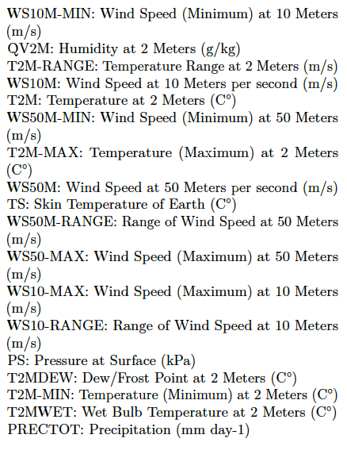
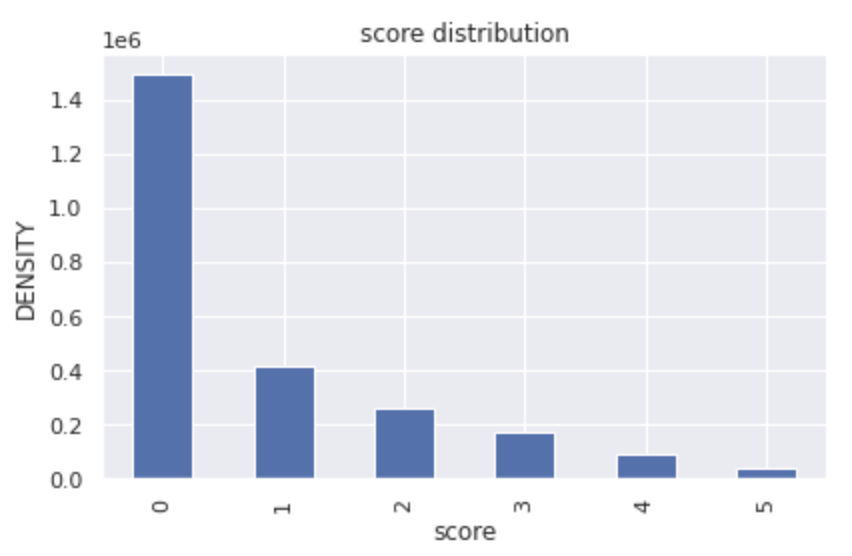

# Abstract
*Agriculture is an important part of the US economy. According to the US government agriculture contributed $1.5 trillion to the economy in 2020 which is a 5% share. However global warming and changes in climate leads to significant drought in various parts of the country which adversely affects agriculture. Unlike other natural disasters, Drought develops slowly and has long term consequences. Hence by leveraging machine learning we can help farmers in taking preventive measures and minimize their loss. Our aim is to provide a comparative study on the performance of different machine learning models in predicting five levels of drought ranging from moderate to extreme using meteorological data.*

# Introduction
Drought estimation and its impact have always been a prime challenge in the agriculture sector. Hence we will be using meteorological data which includes wind, temperature, air pressure, and precipitation information from the year 2000 to 2016 to predict drought severity. Weather conditions and precipitation levels at different heights from the sea level will play important indicators in predicting droughts. We aim to use supervised learning models such as Logistic Regression, Decision Tree, K-Nearest Neighbor, and Logistic Regression for the study and compare their results using performance metrics such as F1 score, accuracy, recall, precision, and ROC curve. The purpose of this study is two folds first is to understand whether a linear model such as logistic regression is preferable for drought classification and understand the performance of each model and which one of them is best suited for our problem.

# Data
The dataset for the project was taken from the source US Drought monitor. It contains 18 attributes of meteorological measures which can estimate Drought. The dataset has about 10 million records which were recorded for years in a particular location in the US. With this data, the aim is to make an analysis of the drought prediction on the forecast data, with this we can generalize the US forecast to predict drought in other regions around the world. Abnormally Dry (D0) to Exceptional Drought (D5) is the range of drought score in the dataset. 

Following are the attributes in the dataset:

*Attribute Name*

# Exploratory Data Analysis
## Identifying Imbalance in Dataset
Since the dataset is labeled, the distribution of scores (according to labels) is examined to determine whether or not the data is biased. The below Figure shows clear imbalance in the dataset with score 5 having very less records of data and score 0 having high records of data. 

*Fig. Distribution of Score*

## Univariate Data Analysis of the features
To determine the skewness in each feature of the dataset, univariate data analysis is performed. Distribution of each attribute is shown in the below Figures. From the figures we can notice that PRICTOT ,WS10M-MIN,WS50M-MIN and WS10M-RANGE are left skewed and PS, T2M, T2M-MAX are right skewed, while other features are distributed across the ranges fairly. 

*Fig. Distribution of Features in the Dataset*

## Bivariate Analysis
To understand the strong correlation between features we used scatter plots. We can see from the below pictures that between the independent variables that have shown strong positive correlation, WS10M - WS50M have a one-to-one  relationship. However, the relationship between  pairs T2M – T2MDEW and QV2M - T2M is not so linear, but the overall correlation is strong.

*Fig. Bivariate Analysis*

## Correlation Matrix
The heatmap is used to represent the correlation between features. The figure from below shows that the features QV2M, T2M, T2MDEW, T2MWET, T2M-MAX, T2M-MIN and TS have shown strong positive correlation. Also, WS10M, WS10M-MAX and WS10M-MIN have shown a strong positive correlation. Finally, WS50M, WS50M-MAX and WS50M-MIN show strong positive correlation. 

*Fig. Correlation Matrix*

# Data Preprocessing
As drought scores are updated once a week whereas meteorological statistics are updated every day, the dataset included records without labels. Since the project aims to perform supervised learning algorithms, the record without labels were removed. The count came down to 2,756,796 rows. Data set contained no null in any attributes. For analysis, Date was split into Day, Month and Year columns. 

## Outlier treatment
Box plot is one of the best methods for the representation of the outliers. It is used to find the spread of values. The box plots from the below show the features PRECTOT, PS,WS10M, WS10M-RANGE,WS50MRANGE,WS50M-MIN. There are no outliers in QV2M.

*Fig. Box plot for outlier analysis*

## Train and Test data
The dataset is divided into training and testing datasets. Standard scalar function is used to fit the training dataset and then remove the fundamental and scale the features unit variance.

## Standardization
The dataset is standardized to bring the mean value to zero and scale the features to unit variance. This step is done as a preprocessing for Principal Component Analysis.

## Feature Selection
For feature selection, the Recursive Feature Elimination method with a Random Forest estimator has been applied. This is due to the fact that random forest tree-based techniques are inherently ordered by the extent to which they maintain node purity. The raw dataset initially contains 23 features, of which the best 15 are chosen for further modeling using the RFE function. These 23 features are fed into the RF model. Using all of the features in the training dataset as a starting point, RFE attempts to find a subset of features by successfully eliminating features one at a time until the desired number of features is left.
This is accomplished by first fitting the base model's machine learning algorithm, ranking the features according to relevance, eliminating the least important features, and then re-fitting the model. Up until a certain amount of features are still present, this process is repeated. PRECTOT, T2MWET, WS10M_MAX, WS10M_MIN, WS50M_MIN, and month, are the features dropped.

## Class Imbalance
To deal with the imbalance between class labels, downsampling and oversampling are performed. Downsampling is done using the Near Miss(NM) method and Neighborhood Cleaning Rule(NCR) method. Oversampling is done using the Synthetic Minority Oversampling Technique(SMOTE) method. The results of these resampling techniques can be seen in the below figures.

### SMOTE
SMOTE selects examples in the feature space that are close to one another, draws a line between the examples, and then creates a new sample at a point along the line.
For example, a random representative from the minority class is initially picked. Next, k nearest neighbors for that example are located. A synthetic example is made at a randomly chosen position in feature space between two instances and their randomly chosen neighbor.

*Fig. Results for SMOTE Oversampling*

### Near Miss
By comparing the distance between instances from the majority class and those from the minority class, the Near Miss undersampling technique chooses examples. In order to have the same number of samples as the minority class, the approach will undersample the majority class.

*Fig. Results for Near Miss Downsampling*

### Neighborhood Cleaning Rule
The Neighborhood Cleaning Rule is an undersampling technique that eliminates redundant samples as well as examples that are noisy or unclear. The samples that are incorrectly classified by a KNN classifier are eliminated in one step. Less examples that are redundant are eliminated, and greater emphasis is made on purifying the examples that are saved.

*Fig. Results for NCR Downsampling*

# Dimenionality Reduction 
Upon observation of the above correlation matrix we observed that that is high correlation between certain features Eg. there is a 95% correlation between T2MDEW & QV2M and that can impact model performance and computing resources. Hence we implemented dimensionality reduction to reduce the number of features by keeping the as much variations as the original dataset. We implemented two dimensionality algorithms namely Principal Component analysis and Linear Discriminant Analysis.

## Principal Component Analysis
Principal Component Analysis (PCA) is a linear dimensionality reduction algorithm which uses variance to reduce transform the data into low dimension. We implemented PCA on both downsampled data using near miss and upsampled data using SMOTE. We picked the features with more than 90% variance.

_Fig. PCA on SMOTE Upsampled Data._

*Fig. PCA on Near Miss Downsampled Data*

## Linear Discriminant Analysis
Linear Discriminant Analysis (LDA) uses classes to separate training instances. Difference between LDA and PCA is that LDA uses linear combination of features which optimizes the class separability whereas PCA uses variance to find set of uncorrelated components. We implemented LDA for both downsampled data with near miss and upsampled data using SMOTE. Using LDA we reduced the number of features to 5 out of 15 features.

*Fig. LDA on SMOTE Upsampled Data*

*Fig. LDA on Near Miss Downsampled Data*

# Methods

## Logistic Regression
We have used logistic regression with multinomial distribution, since this is a multi class classification problem, as the linear model. The datasets used are combinations of resampling techniques to deal with class imbalance like Near Miss(NM) and Neighborhood Cleaning Rule(NCR) for downsampling and Synthetic Minority Oversampling Technique(SMOTE) for over sampling, and dimensionality reduction techniques like Principal Component Analysis(PCA), Linear Discriminant Analysis(LDA), total of 9 resampled datasets and the dataset without resampling and dimensionality reduction. We have performed grid search cross validation on multinomial logistic regression estimator with solvers like newton-cg, lbfgs, sag, saga, and l2 penalty, and searched for the hyperparameter value c, the Inverse of regularization strength, in logarithmic space. We have used repeatedStratified k folds with 3 repeats and 5 folds on the train set to keep the cross validation results stable such that each split has the same proportion of each class label. From gridsearchCV, best parameters are found for a given variation of dataset and it is tested with train and test sets. We used f1_weighted score for comparing different models on a dataset.

## Decision Tree Algorithm
The first method which we implemented is Decision Tree classifier where in we compared classification of each level of drought from class 0 to class 5 with the rest. Understanding the working of decision tree algorithm it breaks the dataset into small subsets while simultaneously expanding the tree nodes. This process continues until we can a pure leaf node without any impurities. The error rate is measured in a term called ‘Entropy’ wherein we try to reduce the entropy to minimum by increasing the information gain. 

*Fig. Decision Tree Structure*

# K Nearest Neighbour Algorithm
K Nearest Neighbour is a supervised machine learning algorithm. It can be used for both classification and regression predictive problems. But it is widely used for classification problems. The algorithm uses a feature similarity method which is used to classify the data points which lie close or match the points in the training set. KNN is easy to interpret and it is also a widely used classification problem. As we know that a classification problem has a definite set of outcomes, KNN attempts to classify the points which lie near and close to each other. We are using Minkowski distance, it can be measured in a space where distances are represented by a vector having a particular length. 
<!-- \
*Fig. Flowchart for KNN* -->

## Random Forest Algorithm 
Before we start discussing the results, Random Forest is a supervised learning algorithm which is mainly used for Classification and Regression tasks. The prime idea behind this algorithm is to generate multiple decision trees on the samples, and finally take the majority voting to give the best result. 

*Fig. Working of Random Forest Algorithm*

# Comparisons

## Method 1: Logistic Regression
For the feasibility of learning, we need to have in-sample error, approximately close to out-sample error i.e, generalizing good on test data, and in-sample error should be small i.e, having more performance on the train set. F1 score is used for comparison. In terms of having more performance on the train set, it can be observed that logistic regression on NCR, logistic regression on NCR downsampled and PCA dimensions and logistic regression without resampling are better from the below F1 score analysis figure. In terms of generalizing good on test data, which implies the model has learned, logistic regression without resampling worked better compared to other logistic regression models. To understand the performance of the models on each class label, roc curves are plotted on the test set predictions.

*Fig. Multiclass ROC curve for Logistic Regression with NCR Downsampled and PCA Data*

*Fig. Multiclass ROC curve for Logistic Regression with NCR Downsampled Data*

*Fig. Multiclass ROC curve for Logistic Regression without Resampling*

*Fig. F1 Score analysis for Logistic Regression*
Although the above-mentioned models have better f1 scores, from the below table we can see that these models have poor recall values for minority class labels, meaning they are biased towards the majority class. Logistic regression with SMOTE oversampling gives better recall of non majority classes. 

*Fig. Recall Analysis for Each class on Logistic Regression*

## Method 2: Decision Tree Algorithm
We performed decision tree on combinations of SMOTE upsampled and Near miss downsampled data along with LDA and PCA. Hence we performed six combinations with these datasets and two combinations with unsampled dataset wherein we implemented it with and without hyperparameter tuning.
We have used the F1 score as the metric to analyze the learning steps. We have used mainly three samples of data for modelling i) SMOTE Unsampled ii) Near Miss Downsampled and iii) Unsampled, with the combinations with PCA and LDA. 

## Decision Tree Algorithm with Near Miss Downsampled Data 
For Classification using only near-miss downsampled data, it is observed that the model is not learning as the training F1 score is 0.94 and the testing F1 score is just 0.26. Similar results are identified when using a combination of Downsampled data with PCA and LDA. Hence it can be concluded that the decision tree classifier has poor performance with downsampled Data. Upon analyzing the ROC curve it is observed that class 5 (high severity drought level) has higher false positive rate compared to other classes and class 0 (low severity drought level) has most true positive rate. However downsampled data has the best ROC curve compared to upsampled and original dataset.

*Fig. Multiclass ROC curve for Decision Tree with Near Miss Downsampled Data*

*Fig. Multiclass ROC curve for Decision Tree with Near Miss Downsampled Data and PCA*

*Fig. Multiclass ROC curve for Decision Tree with Near Miss Downsampled Data and LDA*

## Decision Tree Algorithm with SMOTE Upsampled Data
While using upsampled Data along with a combination of LDA and PCA gives better results with a training F1 score of above 0.9 and a testing F1 score of 0.7. Upon analyzing the multiclass ROC curve it is observed than class 5 has even higher false positive rate compared to near miss downsampled data.

*Fig. Multiclass ROC curve for Decision Tree with SMOTE Upsampled Data*

*Fig. Multiclass ROC curve for Decision Tree with SMOTE Upsampled Data and PCA*

*Fig. Multiclass ROC curve for Decision Tree with SMOTE Upsampled Data and LDA*

## Decision Tree Algorithm with Unsampled Data and HyperParameter Tuning
To optimize the above result we performed hyperparameter tuning on upsampled Data and retrieved the top 5 parameters. Max_depth of 80 gave the best results. Using these parameters with unsampled Data improved the F1 score for testing to >0.75 compared to the training F1 score of 0.9. Upon analyzing the multiclass ROC curve it is observed than class 5 has even higher false positive rate compared to near miss downsampled data and similar to upsampled data.

*Fig. Multiclass ROC curve for Decision Tree with Unsampled Data*

*Fig. Multiclass ROC curve for Decision Tree with Unsampled Data and right Hyperparameters*

*Fig. Learning Analysis of Decision Tree*

## Method 3: K-Nearest Neighbor
We have performed K nearest neighbor classification by using a combination of downsampled, upsampled, and unsampled data along with hyperparameter tuning and dimensionality reduction.
The Minkowski distance between these two points will be calculated using below formula,

*Formula for Minkowsk Distance*

We have used the F1 score as the metric to analyze the learning steps. We have used mainly three samples of data for modeling i) SMOTE Unsampled ii) Near Miss Downsampled and iii) Unsampled, with the combinations with PCA and LDA.

## KNN Algorithm with Near Miss Downsampled Data 
Using near miss downsampled data we have taken F1 score as the metric. The F1 score for training  is 0.93 while the testing score is only 0.26. From this we can tell that the model is not learning. The results are similar for the near miss downsampled LDA and PCA data. Therefore, it can be concluded that KNN algorithm showed poor performance using near miss downsampled data. After generating and analyzing the ROC curve it is observed that class 5 (high severity drought level) has a higher false positive rate compared to other classes and class 0 (low severity drought level) has the most true positive rate.

*Fig. Multiclass ROC curve for KNN with Near Miss Downsampled Data*

*Fig. Multiclass ROC curve for KNN with Near Miss Downsampled Data and PCA*

*Fig. Multiclass ROC curve for KNN with Near Miss Downsampled Data and LDA*

## KNN Algorithm with SMOTE Upsampled Data
Using upsampled data with the combination of LDA and PCA, it is observed that we are getting better results for training and testing data. The F1 score of training data is 0.99 while the F1 score of testing data is 0.79.  Upon generating and analyzing ROC curves it can be seen that class 5 has a higher false positive rate among all the other classes. Therefore it can be concluded that the KNN algorithm is performing better using upsampled data. The images below show the classification results for the upsampled data.

*Fig. Multiclass ROC curve for KNN with SMOTE Upsampled Data*

*Fig. Multiclass ROC curve for KNN with SMOTE Upsampled Data and PCA*

*Fig. Multiclass ROC curve for KNN with SMOTE Upsampled Data and LDA*

## KNN Algorithm with HyperParameter Tuning
For hyperparameter tuning of K- Nearest Neighbor, the value of K is considered from 1 - 10, 3 as the cross validation batch size and the scoring metrics were set to accuracy. Accuracy of KNN Algorithm without resampling after hyperparameter tuning came out to be 0.798.

*Fig. Multiclass ROC curve for KNN without resampling - After Hyperparameter Tuning*

*Fig. Learning Analysis of KNN*

## Method 4: Random Forest Algorithm
After trying the Decision Tree model we decided to try Random Forest as one of the models because it’s like an updated version of decision tree since it gives results by producing various decision trees. It also gives faster training speeds, after experiencing delay training data in KNN, Random Forest gave better time performance. And finally because it was more aligned with our task since the algorithm is more suitable for a large dataset. 
We have used the F1 score as the metric to analyze the learning steps. We have used mainly three samples of data for modelling i) SMOTE Unsampled ii) Near Miss Downsampled and iii) Unsampled, with the combinations with PCA and LDA. 

### Random Forest Algorithm with SMOTE Upsampled Data
Coming to executing the Random Forest with SMOTE upsampled data, with the combinations of PCA and LDA, the results show significant improvement. The training and testing F1 score for SMOTE upsampled data is 0.99 and 0.80 respectively, 0.74 and 0.65 F1 scores when combined with PCA and LDA train data respectively. Following figures depict the ROC curves for Random Forest Algorithm with SMOTE upsampled data and respective combinations. 

*Fig. Multiclass ROC curve for Random Forest Algorithm with SMOTE Upsampled Data*

*Fig. Multiclass ROC curve for Random Forest Algorithm with PCA and SMOTE Upsampled Data*

*Fig. Multiclass ROC curve for Random Forest Algorithm with LDA and SMOTE Upsampled Data*

### Random Forest Algorithm with Near Miss Downsampled Data
After running the Random Forest classification on the near miss downsampled data specifically, it is evident that the F1 score for testing and training data is 0.94 and 0.29 respectively. We can claim from the results that the model is not able to learn with this sample. And when near miss downsampled data is combined with PCA and LDA, the results are shown similar to above score (0.23 and 0.29 F1-scores for PCA and LDA respectively). Hence, we can conclude that Random Forest with near miss downsampled data shows inefficient results. Below figures shows the ROC curves for Random Forest with respective samples. 

*Fig. Multiclass ROC curve for Random Forest Algorithm with Near Miss Downsampled Data*

*Fig. Multiclass ROC curve for Random Forest Algorithm with PCA and Near Miss Downsampled Data*

*Fig. Multiclass ROC curve for Random Forest Algorithm with LDA and Near Miss Downsampled Data*

### Random Forest Algorithm with Unsampled Data
For running Random Forest without resampled data, the F1 score we got for train and test sets are 0.97 and 0.77 respectively. With hyperparameter tuning on the unsampled data with max_depth of 80 and 50 n_estimators, the F1 score was slightly bumped up to 0.79 for train data. The following figures show the ROC curve for Random Forest with respective samples of data. 

*Fig. Multiclass ROC curve for Random Forest Algorithm without Resampling*

*Fig. Multiclass ROC curve for Random Forest Algorithm without Resampling - Right Hyperparameter Modification*

*Fig. Learning Analysis of Random Forest Algorithm*

# Conclusions

