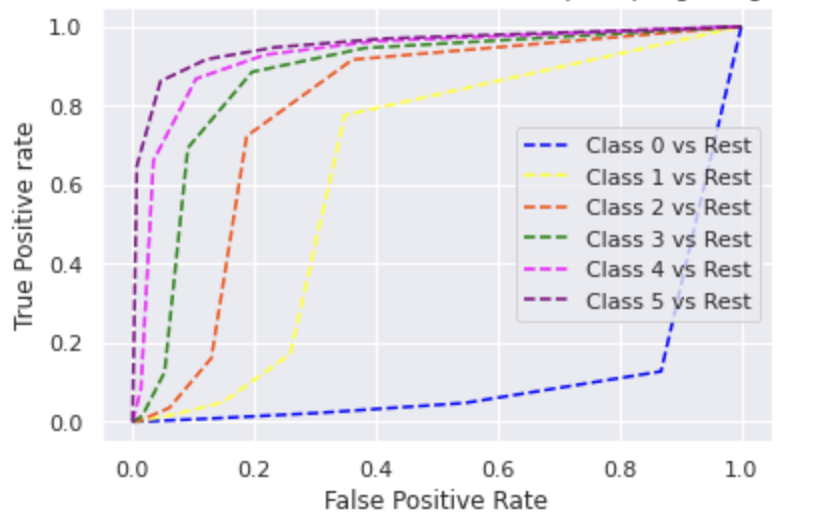

# Abstract
Agriculture is an important part of the US economy. According to the US government agriculture contributed $1.5 trillion to the economy in 2020 which is a 5% share. However global warming and changes in climate leads to significant drought in various parts of the country which adversely affects agriculture. Unlike other natural disasters, Drought develops slowly and has long term consequences. Hence by leveraging machine learning we can help farmers in taking preventive measures and minimize their loss.
Our aim is to provide a comparative study on the performance of different machine learning models in predicting five levels of drought ranging from moderate to extreme using meteorological data. Weather conditions and precipitation levels at different heights from the sea level will play an important indicators for predicting droughts. We aim to use supervised learning models such as Random Forest, Decision Tree, K Nearest Neighbors and Logistic Regression for the study and compare their results using performance metrics such as F1 score, accuracy, recall, precision and ROC curve.

# Introduction

# Data Preprocessing
## Dimenionality Reduction 
Upon observation of the above correlation matrix we observed that that is high correlation between certain features Eg. there is a 95% correlation between T2MDEW & QV2M and that can impact model performance and computing resources. Hence we implemented dimensionality reduction to reduce the number of features by keeping the as much variations as the original dataset. We implemented two dimensionality algorithms namely Principal Component analysis and Linear Discriminant Analysis.

### Principal Component Analysis
Principal Component Analysis (PCA) is a linear dimensionality reduction algorithm which uses variance to reduce transform the data into low dimension. We implemented PCA on both downsampled data using near miss and upsampled data using SMOTE. We picked the features with more than 90% variance.

Fig. PCA on SMOTE Upsampled Data

Fig. PCA on Near Miss Downsampled Data

### Linear Discriminant Analysis
Linear Discriminant Analysis (LDA) uses classes to separate training instances. Difference between LDA and PCA is that LDA uses linear combination of features which optimizes the class separability whereas PCA uses variance to find set of uncorrelated components. We implemented LDA for both downsampled data with near miss and upsampled data using SMOTE. Using LDA we reduced the number of features to 5 out of 15 features.

Fig. LDA on SMOTE Upsampled Data

Fig. LDA on Near Miss Downsampled Data

# Methods
## Decision Tree Algorithm
The first method which we implemented is Decision Tree classifier where in we compared classification of each level of drought from class 0 to class 5 with the rest. Understanding the working of decision tree algorithm it breaks the dataset into small subsets while simultaneously expanding the tree nodes. This process continues until we can a pure leaf node without any impurities. The error rate is measured in a term called ‘Entropy’ wherein we try to reduce the entropy to minimum by increasing the information gain. 

Fig. Decision Tree Structure

# Comparisons
## Method 1: Decision Tree Algorithm
We performed decision tree on combinations of SMOTE upsampled and Near miss downsampled data along with LDA and PCA. Hence we performed six combinations with these datasets and two combinations with unsampled dataset wherein we implemented it with and without hyperparameter tuning.
We have used the F1 score as the metric to analyze the learning steps. We have used mainly three samples of data for modelling i) SMOTE Unsampled ii) Near Miss Downsampled and iii) Unsampled, with the combinations with PCA and LDA . 

## Decision Tree Algorithm with Near Miss Downsampled Data 
For Classification using only near-miss downsampled data, it is observed that the model is not learning as the training F1 score is 0.94 and the testing F1 score is just 0.26. Similar results are identified when using a combination of Downsampled data with PCA and LDA. Hence it can be concluded that the decision tree classifier has poor performance with downsampled Data. Upon analyzing the ROC curve it is observed that class 5 (high severity drought level) has higher false positive rate compared to other classes and class 0 (low severity drought level) has most true positive rate. However downsampled data has the best ROC curve compared to upsampled and original dataset.

Fig. Multiclass ROC curve for Decision Tree with Near Miss Downsampled Data

Fig. Multiclass ROC curve for Decision Tree with Near Miss Downsampled Data and PCA

Fig. Multiclass ROC curve for Decision Tree with Near Miss Downsampled Data and LDA

## Decision Tree Algorithm with SMOTE Upsampled Data
While using upsampled Data along with a combination of LDA and PCA gives better results with a training F1 score of above 0.9 and a testing F1 score of 0.7. Upon analyzing the multiclass ROC curve it is observed than class 5 has even higher false positive rate compared to near miss downsampled data.

Fig. Multiclass ROC curve for Decision Tree with SMOTE Upsampled Data

Fig. Multiclass ROC curve for Decision Tree with SMOTE Upsampled Data and PCA

Fig. Multiclass ROC curve for Decision Tree with SMOTE Upsampled Data and LDA

## Decision Tree Algorithm with Unsampled Data and HyperParameter Tuning
To optimize the above result we performed hyperparameter tuning on upsampled Data and retrieved the top 5 parameters. Max_depth of 80 gave the best results. Using these parameters with unsampled Data improved the F1 score for testing to >0.75 compared to the training F1 score of 0.9. Upon analyzing the multiclass ROC curve it is observed than class 5 has even higher false positive rate compared to near miss downsampled data and similar to upsampled data.

Fig. Multiclass ROC curve for Decision Tree with Unsampled Data

Fig. Multiclass ROC curve for Decision Tree with Unsampled Data and right Hyperparameters

# Example Analysis

# Conclusions

# References
